# Informe de Avance - Proyecto Final Cloud Computing

## Información General

| Campo | Valor |
|---------|---------|
| Proyecto | Plataforma Web Laravel + MySQL Alta Disponibilidad |
| Integrantes | Cayo Vargas Ariel Nelzon |
| Fecha de actualización | 27/05/2026 |
| Región AWS | us-east-1 |
| Estado General | En desarrollo |

---

# 1. Infraestructura Actualizada

## Arquitectura Implementada

| Componente | Servicio | Zona | Estado |
|------------|----------|-------|---------|
| VPC | VPC Personalizada | us-east-1 | Operativo |
| Internet Gateway | IGW | us-east-1 | Operativo |
| Subred Pública A | Public Subnet | us-east-1a | Operativo |
| Subred Privada A | Private Subnet | us-east-1a | Operativo |
| Subred Privada B | Private Subnet | us-east-1b | Operativo |
| EC2 Laravel | Aplicación Web | us-east-1a | Operativo |
| EC2 MySQL Base | Base de Datos Principal | us-east-1a | Operativo |
| EC2 MySQL Replica | Base de Datos Réplica | us-east-1b | En configuración |
| Security Groups | Acceso controlado | us-east-1 | Operativo |
| SSH Bastion | Instancia Laravel pública | us-east-1a | Operativo |
| AMI MySQL | Imagen Base | us-east-1 | Operativo |

---

# 2. Diagrama de Arquitectura

## Estado de Componentes

🟢 Operativo

🟡 En configuración

🔴 Pendiente

### Arquitectura Actual

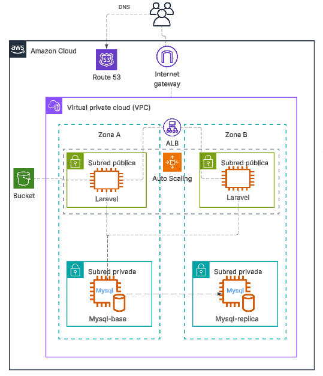

> Reemplazar por la imagen final del diagrama.

### Leyenda

| Componente | Estado |
|------------|---------|
| VPC | 🟢 |
| Internet Gateway | 🟢 |
| Laravel EC2 | 🟢 |
| MySQL Base | 🟢 |
| MySQL Replica | 🟡 |
| Replicación MySQL | 🟡 |
| Load Balancer | 🔴 |
| Auto Scaling Group | 🔴 |
| CI/CD Completo | 🟡 |

---

# 3. Bitácora de Avance

## Entrada 1

**Fecha:** 25/05/2026


**Actividad realizada:**

- Creación de VPC personalizada.
- Creación de subred pública.
- Creación de subredes privadas.
- Asociación de tablas de rutas.
- Configuración de Internet Gateway.

**Dificultad superada:**

Comprensión de la segmentación de red entre componentes públicos y privados dentro de AWS.

---

## Entrada 2

**Fecha:** 26/05/2026


**Actividad realizada:**

- Despliegue de instancia Laravel.
- Configuración de acceso SSH.
- Implementación de patrón Bastion Host.
- Configuración de Security Groups.
- Verificación de conectividad interna mediante IP privada.

**Dificultad superada:**

No era posible conectarse inicialmente a la instancia MySQL privada debido a problemas de autenticación SSH y propagación de claves. Se resolvió utilizando SSH Agent Forwarding.

---

## Entrada 3

**Fecha:** 27/05/2026


**Actividad realizada:**

- Instalación de MySQL Server.
- Creación de AMI de MySQL.
- Despliegue de MySQL Base en subred privada.
- Creación de MySQL Replica desde AMI.
- Configuración de usuario dedicado Laravel.
- Configuración de acceso remoto MySQL.
- Migración de base de datos Laravel.
- Configuración Nginx + PHP-FPM.
- Publicación exitosa de aplicación Laravel.

**Dificultad superada:**

Las instancias privadas no contaban con salida a Internet debido a la ausencia de NAT Gateway. Se optó por crear una instancia temporal pública para instalar y configurar MySQL, generar una AMI y posteriormente desplegar las instancias finales en subredes privadas.

---

# 4. Arquitectura de Red

## VPC

| Parámetro | Valor |
|------------|---------|
| CIDR VPC | 10.0.0.0/16 |
| Región | us-east-1 |

## Subredes

| Subred | Zona | Tipo |
|---------|---------|---------|
| 10.0.0.0/20 | us-east-1a | Pública |
| 10.0.128.0/20 | us-east-1a | Privada |
| 10.0.144.0/20 | us-east-1b | Privada |

---

# 5. Despliegue Laravel

## Tecnologías

- Laravel
- Inertia.js
- Vue.js
- Nginx
- PHP 8.5
- MySQL 8.4

## Estado

| Elemento | Estado |
|-----------|---------|
| Nginx | 🟢 |
| PHP-FPM | 🟢 |
| Laravel | 🟢 |
| Inertia | 🟢 |
| Vue | 🟢 |
| MySQL | 🟢 |
| Migraciones | 🟢 |

---

# 6. Comandos Utilizados

## Conectividad SSH

```bash
ssh -i laravel-base-ssh-key.pem ubuntu@IP_PUBLICA
```

```bash
eval "$(ssh-agent -s)"
ssh-add laravel-base-ssh-key.pem
ssh -A ubuntu@IP_PUBLICA
```

```bash
ssh ubuntu@IP_PRIVADA_MYSQL
```

## Verificación de Red

```bash
ping 10.0.141.111
```

```bash
nc -zv 10.0.141.111 22
```

```bash
ip route
```

## Instalación MySQL

```bash
sudo apt update
sudo apt install mysql-server -y
```

```bash
sudo systemctl status mysql
```

```bash
sudo ss -tlnp | grep 3306
```

## Creación Base de Datos

```sql
CREATE DATABASE laravel_db;
```

```sql
CREATE USER 'laravel_user'@'%' IDENTIFIED BY '********';
```

```sql
GRANT ALL PRIVILEGES ON laravel_db.* TO 'laravel_user'@'%';
FLUSH PRIVILEGES;
```

## Laravel

```bash
composer install
```

```bash
npm install
```

```bash
npm run build
```

```bash
php artisan migrate
```

## Nginx

```bash
sudo nginx -t
```

```bash
sudo systemctl restart nginx
```

```bash
sudo systemctl restart php8.5-fpm
```

---

# 7. Evidencias

## 7.1 VPC

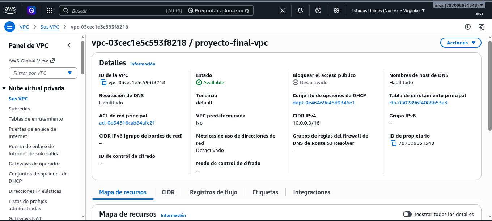

---

## 7.2 Subredes

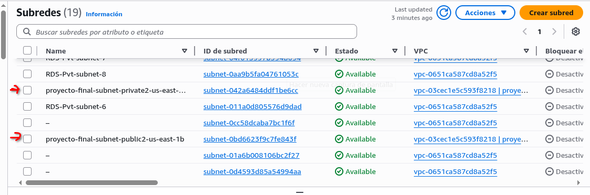
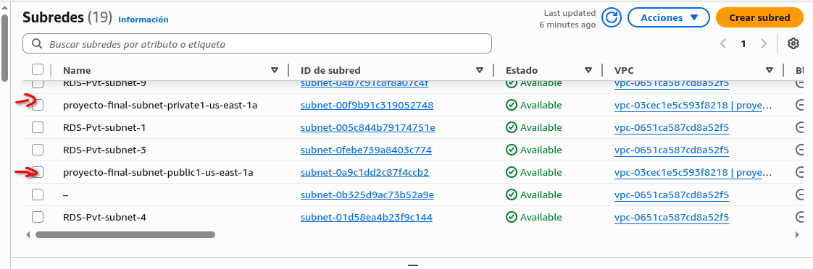

---

## 7.3 Tabla de Rutas

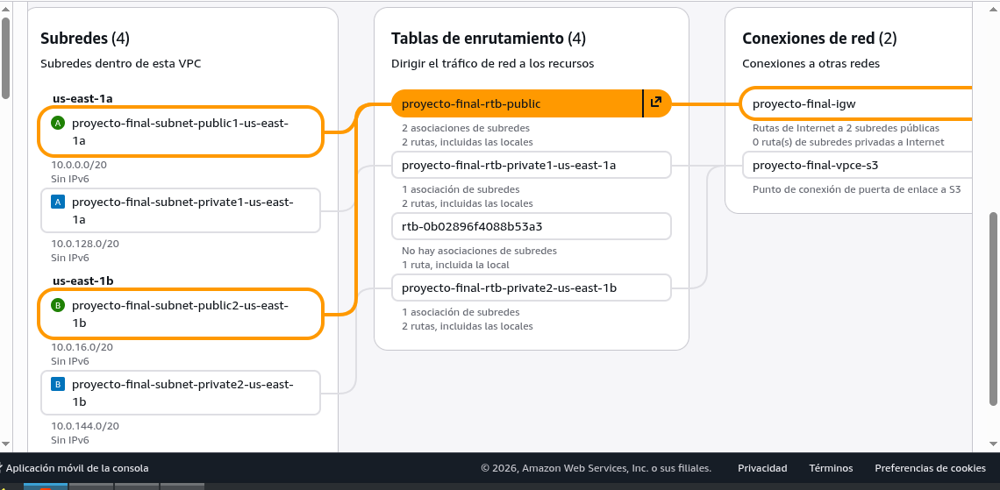

---

## 7.4 Security Groups

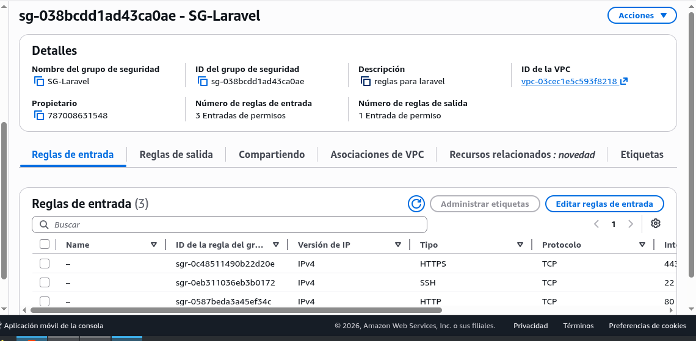
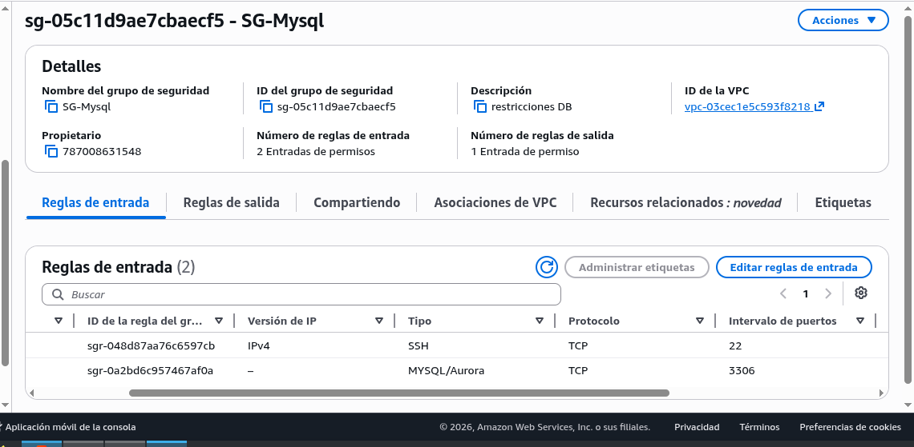

---

## 7.5 Instancia Laravel

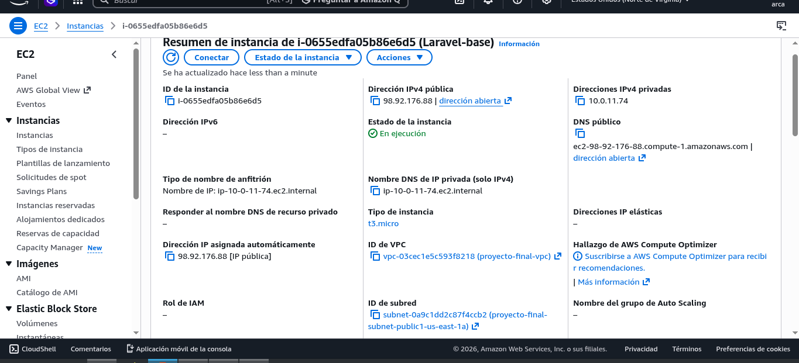

---

## 7.6 Instancia MySQL Base


---

## 7.7 Instancia MySQL Replica

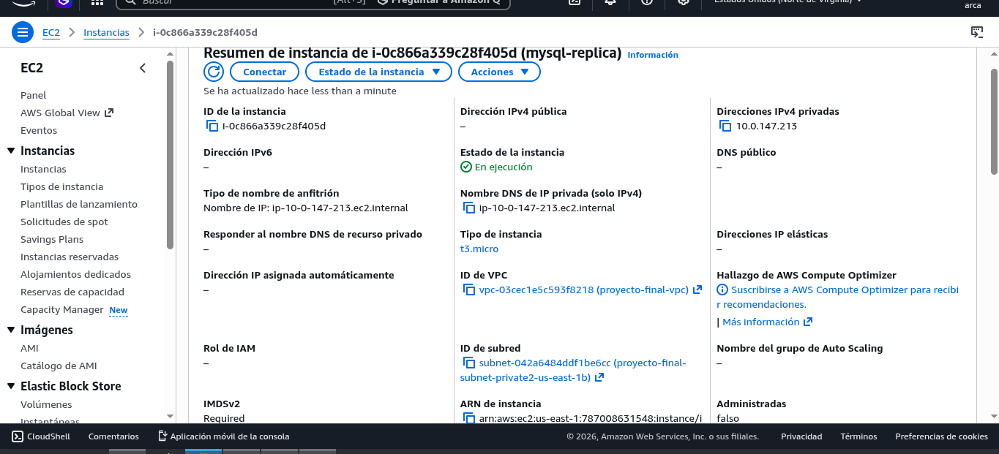

---

## 7.8 Conectividad SSH Bastion

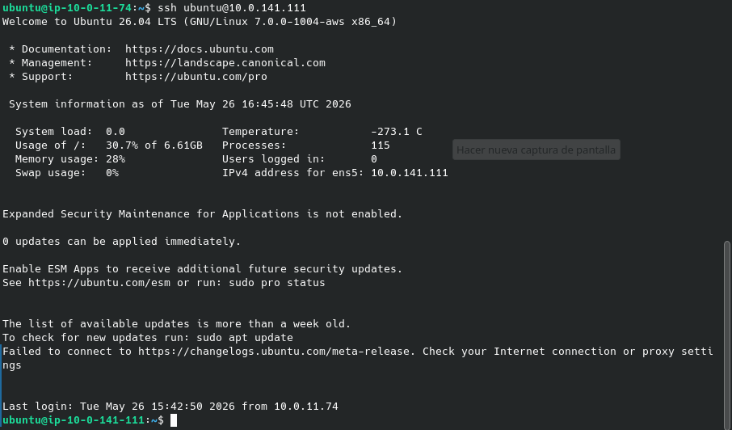

---

## 7.9 Migraciones Laravel

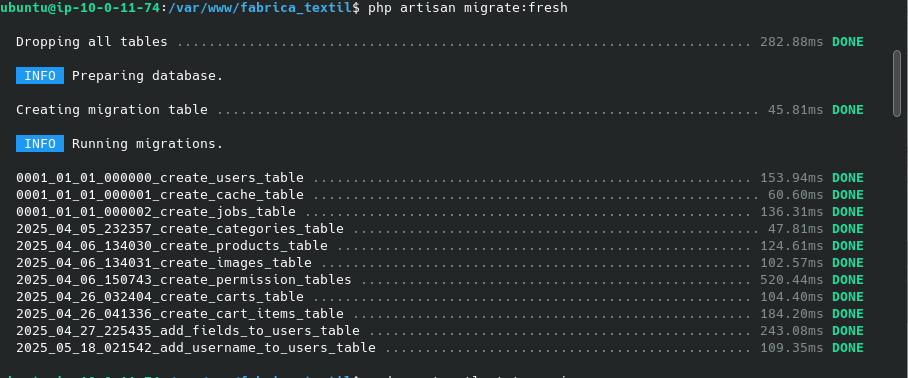

---

## 7.10 Aplicación Ejecutándose

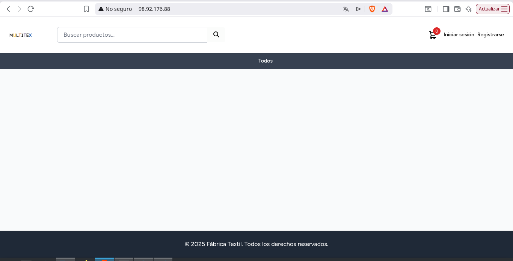

---


---

# 8. Actividades Pendientes

| Actividad | Estado |
|------------|---------|
| Configurar replicación MySQL Master-Replica | 🟡 |
| Crear Application Load Balancer | 🔴 |
| Implementar Auto Scaling Group | 🔴 |
| Automatizar despliegue CI/CD | 🟡 |
| Configurar HTTPS con Let's Encrypt | 🔴 |
| Configurar monitoreo CloudWatch | 🔴 |
| Pruebas de alta disponibilidad | 🔴 |

---

# 9. Conclusiones

Se logró desplegar exitosamente una arquitectura distribuida sobre AWS utilizando una VPC personalizada con separación de capas públicas y privadas. La aplicación Laravel se encuentra accesible mediante IP pública, conectada a una base de datos MySQL ubicada en una subred privada. Se implementó acceso seguro mediante Bastion Host y se preparó la infraestructura necesaria para la futura configuración de replicación y alta disponibilidad.