# 🏭 Fábrica Textil — Plataforma Web Laravel en AWS con Alta Disponibilidad

> Proyecto Final — Cloud Computing  
> Alumno: **Cayo Vargas Ariel Nelzon** | Región: `us-east-1`

[](https://laravel.com)
[](https://aws.amazon.com)
[](https://mysql.com)
[](https://vuejs.org)
[](https://github.com/features/actions)

---

## 📋 Tabla de Contenidos

- [Descripción General](#descripción-general)
- [Stack Tecnológico](#stack-tecnológico)
- [Arquitectura AWS](#arquitectura-aws)
- [Infraestructura de Red](#infraestructura-de-red)
- [Paso 1 — VPC y Subredes](#paso-1--vpc-y-subredes)
- [Paso 2 — Security Groups](#paso-2--security-groups)
- [Paso 3 — Bastion Host y Acceso SSH](#paso-3--bastion-host-y-acceso-ssh)
- [Paso 4 — Base de Datos MySQL](#paso-4--base-de-datos-mysql)
- [Paso 5 — Replicación MySQL Master-Replica](#paso-5--replicación-mysql-master-replica)
- [Paso 6 — Despliegue de Laravel](#paso-6--despliegue-de-laravel)
- [Paso 7 — AMI Laravel, Target Group y Load Balancer](#paso-7--ami-laravel-target-group-y-load-balancer)
- [Paso 8 — Auto Scaling Group](#paso-8--auto-scaling-group)
- [Paso 9 — Autenticación OIDC para GitHub Actions](#paso-9--autenticación-oidc-para-github-actions)
- [Paso 10 — Almacenamiento S3 para Imágenes de Productos](#paso-10--almacenamiento-s3-para-imágenes-de-productos)
- [Paso 11 — Dominio y HTTPS](#paso-11--dominio-y-https)
- [Estado del Proyecto](#estado-del-proyecto)
- [Bitácora de Avance](#bitácora-de-avance)

---

## Descripción General

Plataforma web de gestión para una fábrica textil, desarrollada con **Laravel + Inertia.js + Vue.js**, desplegada sobre infraestructura AWS con arquitectura de **alta disponibilidad** en múltiples zonas de disponibilidad (`us-east-1a` / `us-east-1b`).

La solución implementa:
- Separación de capas públicas y privadas mediante VPC personalizada
- Base de datos MySQL con replicación Master-Replica en subredes privadas
- Application Load Balancer + Auto Scaling Group para alta disponibilidad
- Integración CI/CD con GitHub Actions autenticado via **OIDC + IAM Role** (sin credenciales estáticas)
- Almacenamiento de imágenes de productos en **Amazon S3**

🔗 **Repositorio:** [github.com/ariel101/fabrica_textil](https://github.com/ariel101/fabrica_textil)

---

## Stack Tecnológico

| Capa | Tecnología |
|------|------------|
| Framework | Laravel |
| Frontend | Inertia.js + Vue.js |
| Web Server | Nginx |
| Runtime | PHP 8.5 + PHP-FPM |
| Base de Datos | MySQL 8.4 |
| Infraestructura | AWS (VPC, EC2, ALB, ASG, S3, IAM) |
| CI/CD | GitHub Actions + OIDC (IAM Role) |
| Almacenamiento | Amazon S3 |

---

## Arquitectura AWS

```
Internet
    │
    ▼
[Internet Gateway]
    │
    ▼
[Application Load Balancer]  ←── Subred Pública (us-east-1a / 1b)
    │
    ├─────────────────────────────────────┐
    ▼                                     ▼
[EC2 Laravel #1]               [EC2 Laravel #2]   ← Auto Scaling Group
  us-east-1a                     us-east-1b
    │                                     │
    └─────────────┬───────────────────────┘
                  │
        ┌─────────┴─────────┐
        ▼                   ▼
  [MySQL Master]     [MySQL Replica]
   us-east-1a          us-east-1b
  (Subred Privada)   (Subred Privada)

GitHub Actions ──(OIDC / IAM Role)──► AWS (deploy, S3, ECR...)
                                            │
                                            ▼
                                      [Amazon S3]
                                  fabrica-textil-productos
                                  (imágenes de telas/productos)
```

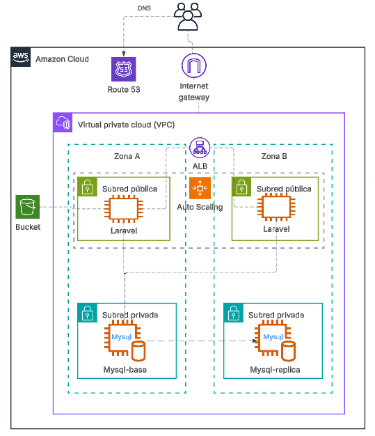

---

## Infraestructura de Red

### VPC

| Parámetro | Valor |
|-----------|-------|
| CIDR Block | `10.0.0.0/16` |
| Región | `us-east-1` |
| DNS Hostnames | Habilitado |
| Internet Gateway | Adjunto |

### Subredes

| Nombre | CIDR | Zona | Tipo | Uso |
|--------|------|------|------|-----|
| public-subnet-1a | `10.0.0.0/20` | us-east-1a | Pública | ALB, Laravel EC2, Bastion |
| private-subnet-1a | `10.0.128.0/20` | us-east-1a | Privada | MySQL Master |
| private-subnet-1b | `10.0.144.0/20` | us-east-1b | Privada | MySQL Replica |

---

## Paso 1 — VPC y Subredes

### 1.1 Crear VPC

**VPC → Your VPCs → Create VPC**

- Name tag: `fabrica-textil-vpc`
- IPv4 CIDR: `10.0.0.0/16`
- Tenancy: Default
- DNS resolution: Enabled
- DNS hostnames: Enabled

### 1.2 Crear y adjuntar Internet Gateway

```
VPC → Internet Gateways → Create internet gateway
  Name: fabrica-textil-igw

Actions → Attach to VPC → fabrica-textil-vpc
```

### 1.3 Crear Subredes

**VPC → Subnets → Create subnet**

| Campo | Subred Pública | Subred Privada A | Subred Privada B |
|-------|---------------|-----------------|-----------------|
| VPC | proyecto-final-public1 | proyecto-final-private1 | proyecto-final-private2 |
| Availability Zone | us-east-1a | us-east-1a | us-east-1b |
| IPv4 CIDR | `10.0.0.0/20` | `10.0.128.0/20` | `10.0.144.0/20` |

Habilitar **Auto-assign public IPv4** en la subred pública:  
`Subnet → Actions → Edit subnet settings → Enable auto-assign public IPv4`

### 1.4 Configurar Tablas de Rutas

**Tabla de rutas pública** (asociada a la subred pública):

| Destino | Target |
|---------|--------|
| `10.0.0.0/16` | local |
| `0.0.0.0/0` | proyecto-final-igw |

**Tablas de rutas privadas** (una por subred privada):

| Destino | Target |
|---------|--------|
| `10.0.0.0/16` | local |

> Las subredes privadas no tienen ruta a internet — las instancias MySQL son completamente inaccesibles desde el exterior.

---

> 📸 Evidencias:

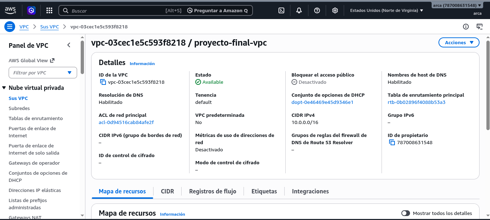

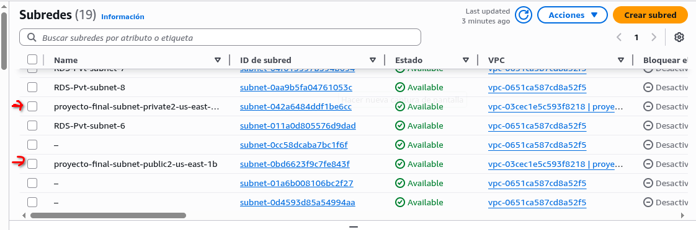
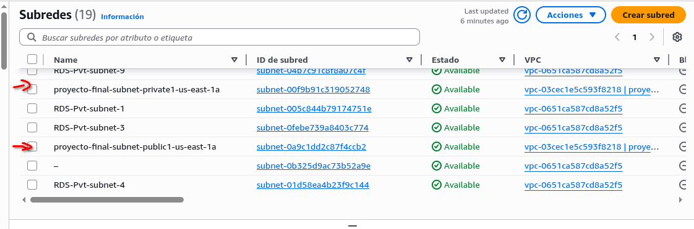

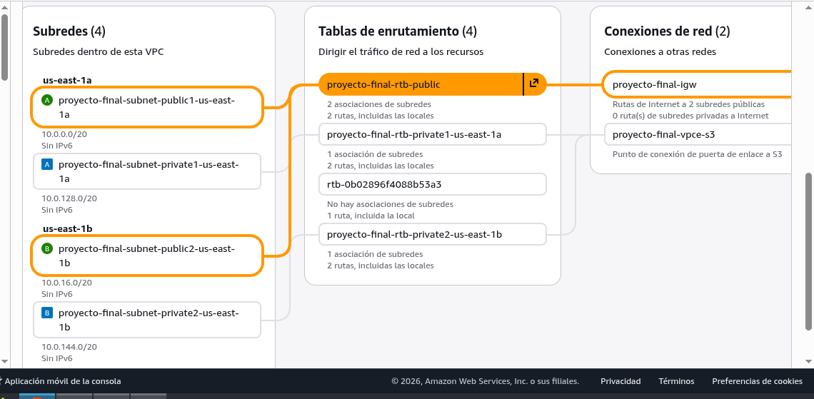

---

## Paso 2 — Security Groups

Se definieron tres security groups siguiendo el principio de **mínimo privilegio**. Las instancias MySQL solo aceptan conexiones desde el security group de Laravel — nunca desde internet.

### sg-alb (Application Load Balancer)

| Tipo | Puerto | Origen | Descripción |
|------|--------|--------|-------------|
| HTTP | 80 | `0.0.0.0/0` | Tráfico público entrante |
| HTTPS | 443 | `0.0.0.0/0` | Tráfico público TLS |

### SG-Laravel (Instancias EC2 Laravel)

| Tipo | Puerto | Origen | Descripción |
|------|--------|--------|-------------|
| SSH | 22 | IP personal | Acceso administración / Bastion |
| HTTP | 80 | `0.0.0.0/0` | Solo desde el ALB |
| HTTPS | 443 | `0.0.0.0/0` | Solo desde el ALB |

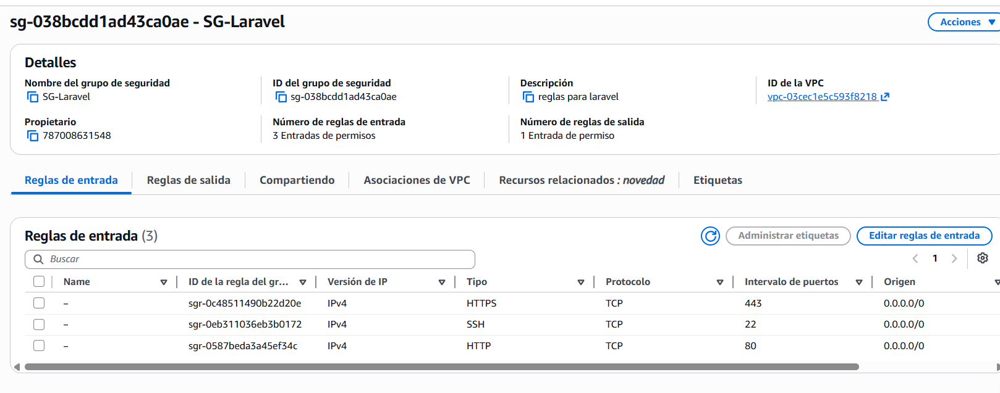

### SG-Mysql (Instancias MySQL)

| Tipo | Puerto | Origen | Descripción |
|------|--------|--------|-------------|
| MySQL/Aurora | 3306 | SG-Laravel | Solo desde instancia Laravel |
| SSH | 22 | SG-Laravel | Acceso vía Bastion |
| MySQL/Aurora | 3306 | SG-Mysql-replica | Solo desde instancia mysql replica |

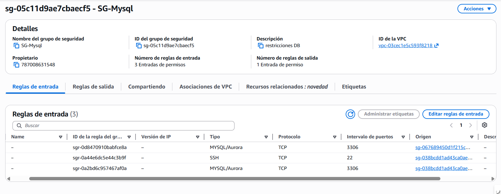

### SG-Mysql-replica (Instancias MySQL)

| Tipo | Puerto | Origen | Descripción |
|------|--------|--------|-------------|
| MySQL/Aurora | 3306 | SG-Laravel | Solo desde instancia Laravel |
| SSH | 22 | SG-Laravel | Acceso vía Bastion |

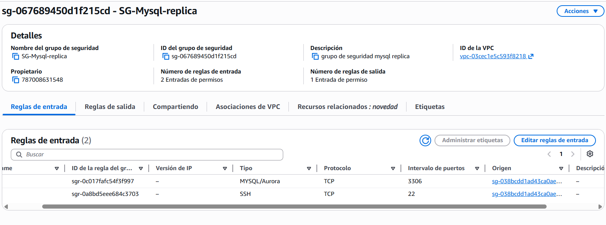
---


---

## Paso 3 — Bastion Host y Acceso SSH

La instancia **Bastion** en la subred pública actúa como **Bastion Host** para saltar a las instancias MySQL en subredes privadas. No se desplegó un NAT Gateway para reducir costos — en su lugar se usó una AMI preconfigurada (ver Paso 4).

### Acceso directo a Instancia Bastion (Bastion)

```bash
ssh -i laravel-base-ssh-key.pem ubuntu@98.92.222.80
```

### Acceso a MySQL privado vía SSH Agent Forwarding

```bash
# Cargar la clave en el agente SSH local
eval "$(ssh-agent -s)"
ssh-add laravel-base-ssh-key.pem

# Conectar al Bastion con reenvío de agente (-A)
ssh -A ubuntu@98.92.222.80

# Desde el Bastion, saltar a la instancia mysql-base privada
ssh ubuntu@10.0.128.237

# Desde el Bastion, saltar a la instancia mysql-replica privada 
ssh ubuntu@10.0.147.213
```

> Con `-A` (Agent Forwarding), la clave privada nunca sale de la máquina local — el agente autentica los saltos intermedios de forma transparente.

### Verificar conectividad interna

```bash
# Comprobar que el puerto 3306 es alcanzable desde Laravel
nc -zv 10.0.128.237 3306

# Ver tabla de rutas del sistema operativo
ip route
```

---

> 📸 Evidencias:

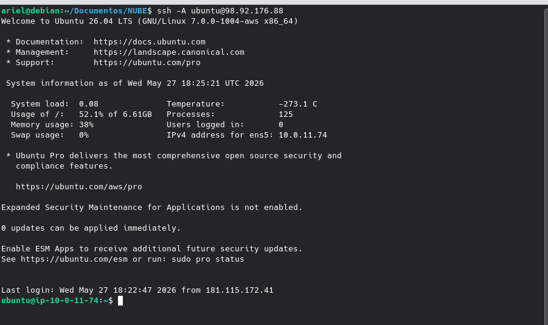
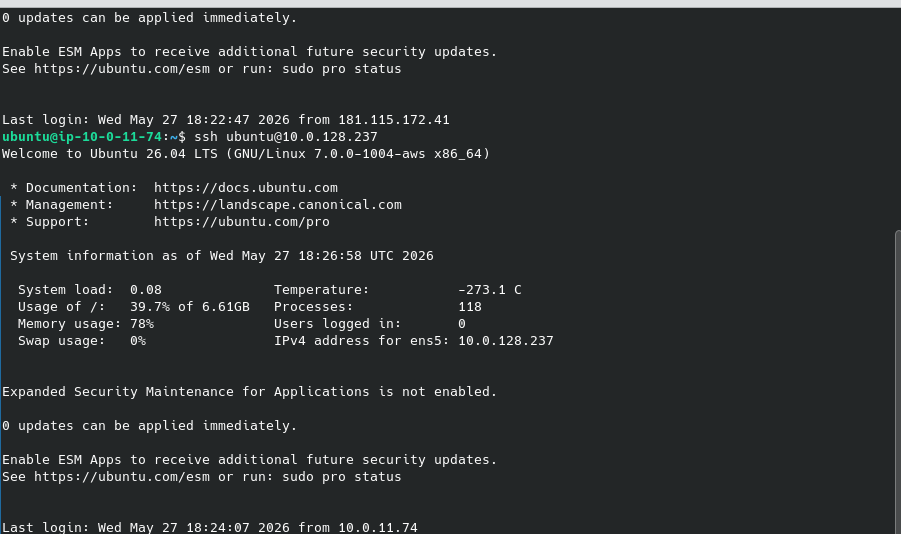

---

## Paso 4 — Base de Datos MySQL

### Estrategia de despliegue en subred privada

Como las subredes privadas no tienen salida a internet (sin NAT Gateway), no es posible instalar paquetes directamente. La solución implementada fue:

```
[EC2 Temporal Pública]
       │
       ├─ apt install mysql-server
       ├─ Configurar MySQL + usuario Laravel
       └─ Crear AMI  ──────────────────────────────┐
                                                    │
                                    ┌───────────────┴──────────────┐
                                    ▼                              ▼
                            [MySQL Master]                 [MySQL Replica]
                            private-subnet-1a              private-subnet-1b
                            10.0.128.0/20                  10.0.144.0/20
```

### 4.1 Instalación de MySQL (en instancia temporal pública)

```bash
sudo apt update && sudo apt install mysql-server -y
sudo systemctl enable mysql
sudo systemctl start mysql

# Verificar que el servicio está corriendo
sudo systemctl status mysql

# Verificar que escucha en el puerto 3306
sudo ss -tlnp | grep 3306
```

### 4.2 Crear base de datos y usuario para Laravel

```sql
-- Conectar como root
sudo mysql

-- Crear base de datos con charset correcto para Laravel
CREATE DATABASE laravel_db CHARACTER SET utf8mb4 COLLATE utf8mb4_unicode_ci;

-- Usuario con acceso desde cualquier IP de la VPC
CREATE USER 'laravel_user'@'%' IDENTIFIED BY 'password_seguro';
GRANT ALL PRIVILEGES ON laravel_db.* TO 'laravel_user'@'%';
FLUSH PRIVILEGES;
```

### 4.3 Habilitar acceso remoto

Editar `/etc/mysql/mysql.conf.d/mysqld.cnf`:

```ini
[mysqld]
bind-address = 0.0.0.0
```

```bash
sudo systemctl restart mysql

# Confirmar que escucha en 0.0.0.0:3306
sudo ss -tlnp | grep 3306
```

### 4.4 Crear AMI de MySQL

```
EC2 → Instancias → [instancia temporal MySQL]
→ Actions → Image and templates → Create image

  Image name:        mysql-base-ami
  No reboot:         ✓ (mantiene el estado del sistema de archivos)
```

### 4.5 Lanzar instancias MySQL desde la AMI

```
EC2 → Launch Instances → My AMIs → mysql-base-ami

  MySQL Master:
    Subnet:         private-subnet-1a  (10.0.128.0/20)
    Security Group: sg-mysql
    Key pair:       laravel-base-ssh-key

  MySQL Replica:
    Subnet:         private-subnet-1b  (10.0.144.0/20)
    Security Group: sg-mysql
    Key pair:       laravel-base-ssh-key
```

---

> 📸 Evidencias:


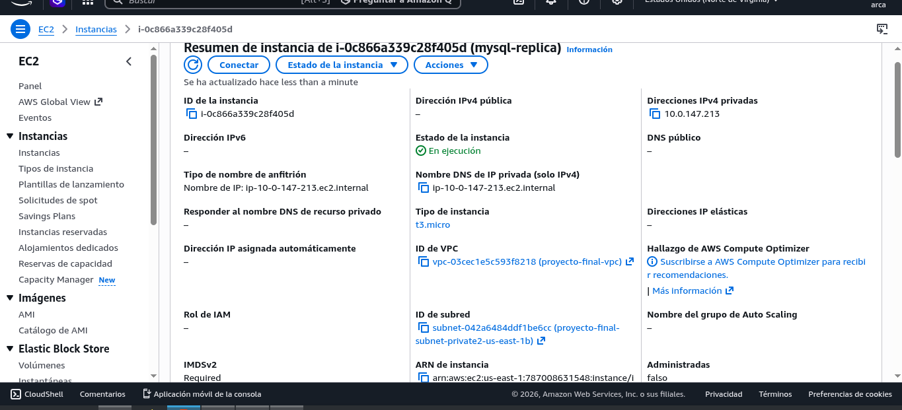

---

## Paso 5 — Replicación MySQL Master-Replica

La replicación asegura que todos los escrituras al Master se propagan automáticamente a la Replica en `us-east-1b`, permitiendo recuperación ante fallos de zona.

### 5.1 Configurar Master (`/etc/mysql/mysql.conf.d/mysqld.cnf`)

```ini
[mysqld]
server-id           = 1
log_bin             = /var/log/mysql/mysql-bin.log
binlog_do_db        = laravel_db
bind-address        = 0.0.0.0
```

```bash
sudo systemctl restart mysql
```

```sql
-- Crear usuario dedicado para replicación
CREATE USER 'replica_user'@'%' IDENTIFIED WITH mysql_native_password BY 'replica_password';
GRANT REPLICATION SLAVE ON *.* TO 'replica_user'@'%';
FLUSH PRIVILEGES;

-- Bloquear tablas y obtener posición del binlog
FLUSH TABLES WITH READ LOCK;
SHOW MASTER STATUS;
-- Anotar: File (ej. mysql-bin.000001) y Position (ej. 154)
UNLOCK TABLES;
```

### 5.2 Configurar Replica (`/etc/mysql/mysql.conf.d/mysqld.cnf`)

```ini
[mysqld]
server-id           = 2
relay-log           = /var/log/mysql/mysql-relay-bin.log
read_only           = 1
bind-address        = 0.0.0.0
```

```bash
sudo systemctl restart mysql
```

```sql
-- Apuntar la Replica al Master (usar IP privada del Master)
CHANGE MASTER TO
  MASTER_HOST     = '10.0.128.237',
  MASTER_USER     = 'replica_user',
  MASTER_PASSWORD = 'replica_password',
  MASTER_LOG_FILE = 'mysql-bin.000001',   -- valor de SHOW MASTER STATUS
  MASTER_LOG_POS  = 154;                  -- valor de SHOW MASTER STATUS

START SLAVE;

-- Verificar que ambos hilos están corriendo
SHOW SLAVE STATUS\G
-- Slave_IO_Running:  Yes
-- Slave_SQL_Running: Yes
```

---

## Paso 6 — Despliegue de Laravel

### 6.1 Dependencias del sistema

```bash
sudo apt update
sudo apt install -y nginx php8.5 php8.5-fpm php8.5-mysql php8.5-mbstring \
    php8.5-xml php8.5-curl php8.5-zip php8.5-bcmath php8.5-intl unzip curl git

# Composer
curl -sS https://getcomposer.org/installer | php
sudo mv composer.phar /usr/local/bin/composer

# Node.js 20 (para Vite / compilar assets)
curl -fsSL https://deb.nodesource.com/setup_20.x | sudo -E bash -
sudo apt install -y nodejs
```

### 6.2 Clonar y configurar el proyecto

```bash
cd /var/www
sudo git clone https://github.com/ariel101/fabrica_textil.git
sudo chown -R www-data:www-data fabrica_textil
cd fabrica_textil

# Dependencias PHP
composer install --no-dev --optimize-autoloader

# Compilar assets frontend (Inertia + Vue)
npm install
npm run build
```

### 6.3 Variables de entorno

```bash
cp .env.example .env
php artisan key:generate
```

`.env` relevante:

```env
APP_NAME="Fábrica Textil"
APP_ENV=production
APP_URL=https://tu-dominio.com

DB_CONNECTION=mysql
DB_HOST=10.0.128.237        # IP privada MySQL Master
DB_PORT=3306
DB_DATABASE=laravel_db
DB_USERNAME=laravel_user
DB_PASSWORD=password_seguro

FILESYSTEM_DISK=s3
AWS_BUCKET=fabrica-textil-imagenes
AWS_DEFAULT_REGION=us-east-1
# AWS_ACCESS_KEY_ID y AWS_SECRET_ACCESS_KEY no son necesarios
# la instancia EC2 tiene un IAM Role adjunto
```

### 6.4 Migraciones y optimizaciones

```bash
php artisan migrate --force
php artisan storage:link

# Cachear configuración, rutas y vistas para producción
php artisan config:cache
php artisan route:cache
php artisan view:cache
```

### 6.5 Configurar Nginx

`/etc/nginx/sites-available/fabrica_textil`:

```nginx
server {
    listen 80;
    server_name _;

    root /var/www/fabrica_textil/public;
    index index.php;

    charset utf-8;

    location / {
        try_files $uri $uri/ /index.php?$query_string;
    }

    location ~ \.php$ {
        include snippets/fastcgi-php.conf;
        fastcgi_pass unix:/run/php/php8.5-fpm.sock;
    }

    location ~ /\.(?!well-known).* {
        deny all;
    }
}
```

```bash
sudo ln -s /etc/nginx/sites-available/fabrica_textil /etc/nginx/sites-enabled/
sudo nginx -t && sudo systemctl reload nginx
sudo systemctl restart php8.5-fpm
```

---

> 📸 Evidencias:

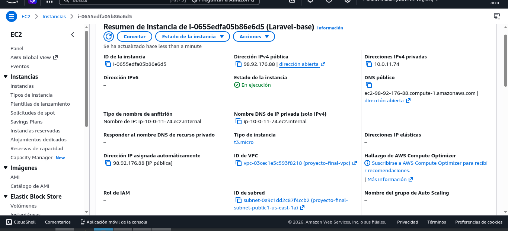

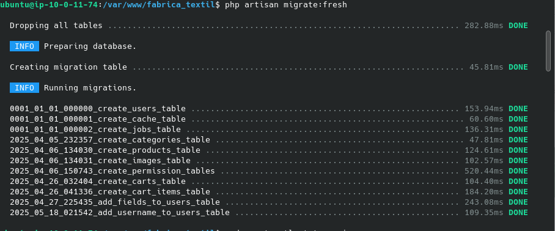

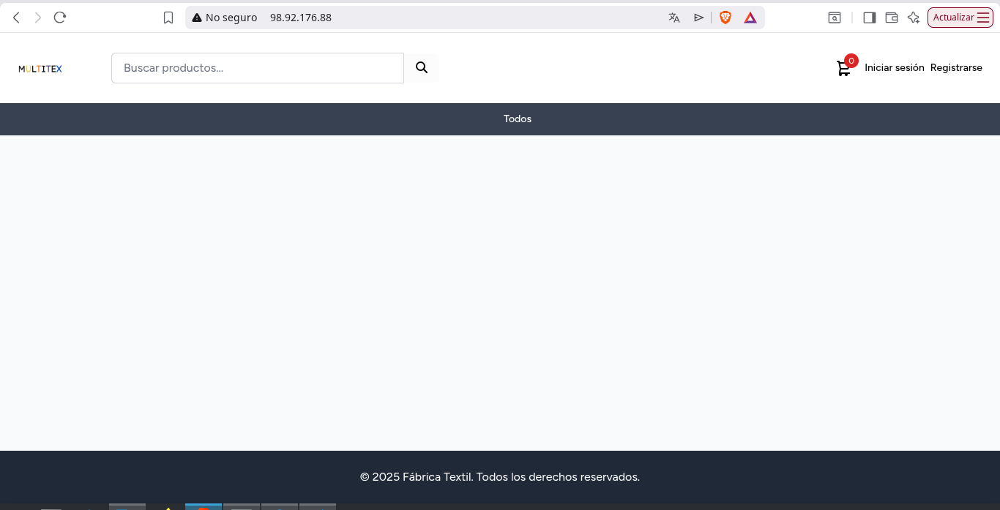

---

## Paso 7 — AMI Laravel, Target Group y Load Balancer

### 7.1 Crear AMI de Laravel

Una vez la instancia Laravel está completamente configurada y funcionando, se genera una AMI que servirá de base para el Auto Scaling Group.

```
EC2 → Instancias → [instancia Laravel configurada]
→ Actions → Image and templates → Create image

  Image name:  laravel-prod-v1
  No reboot:   ✓
```
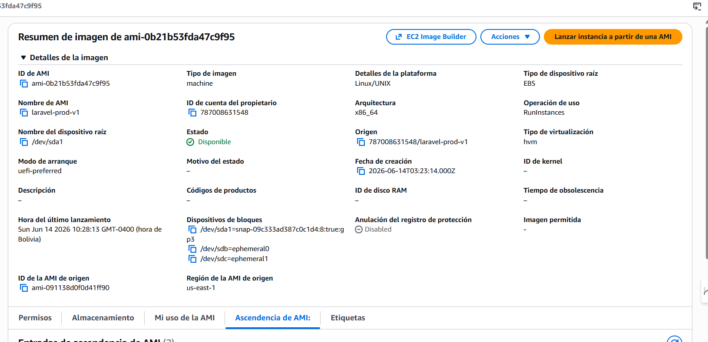

### 7.2 Crear Target Group

```
EC2 → Target Groups → Create Target Group
```

| Campo | Valor |
|-------|-------|
| Target type | Instances |
| Name | `tg-laravel-app` |
| Protocol | HTTP |
| Port | 80 |
| VPC | proyecto-final-vpc |
| Health check protocol | HTTP |
| Health check path | `/` |
| Healthy threshold | 2 |
| Unhealthy threshold | 3 |
| Interval | 30 segundos |

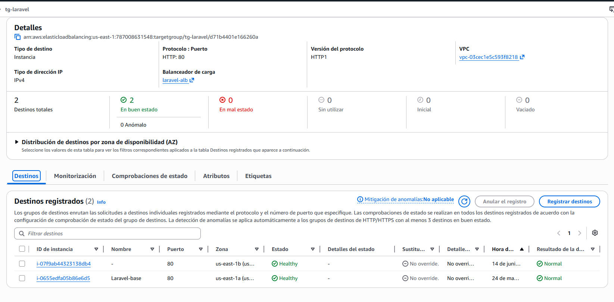

### 7.3 Crear Application Load Balancer

```
EC2 → Load Balancers → Create Load Balancer → Application Load Balancer
```

| Campo | Valor |
|-------|-------|
| Name | `laravel-alb` |
| Scheme | Internet-facing |
| IP address type | IPv4 |
| VPC | proyecto-final |
| Availability Zones | us-east-1a (public-subnet-1a), us-east-1b |
| Security Groups | sg-alb |

**Listeners:**

| Protocolo | Puerto | Acción |
|-----------|--------|--------|
| HTTP | 80 | Forward → `tg-laravel` |

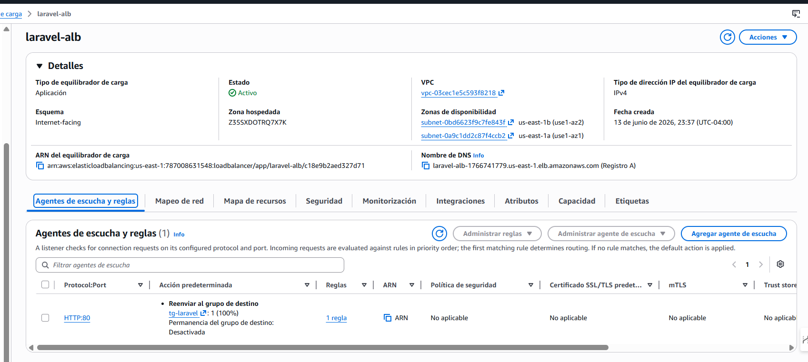

> El listener HTTPS (443) se configurará al agregar el dominio y el certificado ACM.

El ALB distribuye el tráfico entre las instancias registradas en `tg-laravel` mediante round-robin, con health checks periódicos para excluir instancias no saludables.

---

> 📸 Evidencias:

<!-- Agregar imagen: ./capturas/alb.png -->

<!-- Agregar imagen: ./capturas/target-group.png -->

---

## Paso 8 — Auto Scaling Group

### 8.1 Crear Launch Template

```
EC2 → Launch Templates → Create launch template
```

| Campo | Valor |
|-------|-------|
| Name | `LT-laravel` |
| AMI | laravel-prod-v1 |
| Instance type | `t3.micro` |
| Key pair | laravel-base-ssh-key |
| Security Groups | SG-Laravel |

**User Data** (script ejecutado al lanzar cada nueva instancia):

```bash
#!/bin/bash
set -e

cd /var/www/fabrica_textil

# Actualizar código desde repositorio
git pull origin main

# Actualizar dependencias
composer install --no-dev --optimize-autoloader
npm ci && npm run build

# Actualizar caché de Laravel
php artisan config:cache
php artisan route:cache
php artisan view:cache

# Reiniciar servicios
sudo systemctl restart php8.5-fpm
sudo systemctl reload nginx
```

### 8.2 Crear Auto Scaling Group

```
EC2 → Auto Scaling Groups → Create Auto Scaling Group
```

| Campo | Valor |
|-------|-------|
| Name | `ASG-laravel` |
| Launch Template | LT-laravel |
| VPC | proyecto-final-vpc |
| Subnets | public-subnet-1a, public-subnet-1b |
| Load balancing | Attach to existing ALB → `tg-laravel` |
| Health check type | ELB |
| Desired capacity | 2 |
| Minimum capacity | 1 |
| Maximum capacity | 2 |

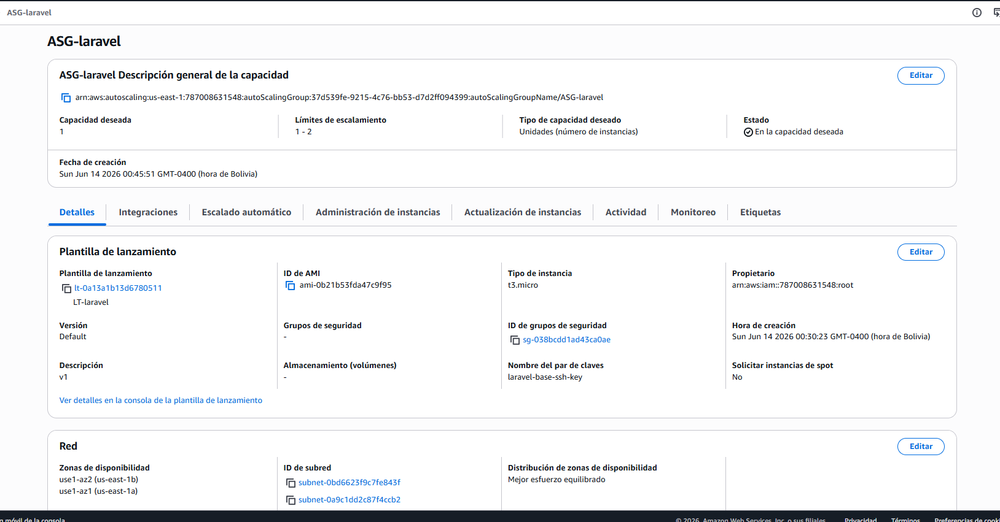

**Política de escalado — Target Tracking:**

| Parámetro | Valor |
|-----------|-------|
| Métrica | Average CPU Utilization |
| Target | 70% |
| Warmup | 300 segundos |

> Con esta configuración, cuando la CPU promedio supera el 70%, el ASG lanza nuevas instancias automáticamente desde la AMI de Laravel. Cuando baja del umbral, las elimina para reducir costos.

---

---

## Paso 9 — Autenticación OIDC para GitHub Actions

En lugar de almacenar credenciales de AWS (`AWS_ACCESS_KEY_ID` / `AWS_SECRET_ACCESS_KEY`) como secrets en GitHub, se implementó autenticación mediante **OpenID Connect (OIDC)**. GitHub Actions solicita un token JWT firmado por GitHub al proveedor OIDC de AWS (IAM), y AWS valida ese token para asumir un IAM Role con los permisos necesarios. **No se manejan claves estáticas.**

### 9.1 Crear el Identity Provider OIDC en IAM

```
IAM → Identity providers → Add provider

  Provider type: OpenID Connect
  Provider URL:  https://token.actions.githubusercontent.com
  Audience:      sts.amazonaws.com
```

Tras crearlo, copiar el **ARN del provider**, por ejemplo:
```
arn:aws:iam::123456789012:oidc-provider/token.actions.githubusercontent.com
```

### 9.2 Crear IAM Role con trust policy para GitHub

```
IAM → Roles → Create role → Web identity

  Identity provider: token.actions.githubusercontent.com
  Audience:          sts.amazonaws.com
```

**Trust Policy** (reemplazar con tu usuario/repositorio):

```json
{
  "Version": "2012-10-17",
  "Statement": [
    {
      "Effect": "Allow",
      "Principal": {
        "Federated": "arn:aws:iam::123456789012:oidc-provider/token.actions.githubusercontent.com"
      },
      "Action": "sts:AssumeRoleWithWebIdentity",
      "Condition": {
        "StringEquals": {
          "token.actions.githubusercontent.com:aud": "sts.amazonaws.com"
        },
        "StringLike": {
          "token.actions.githubusercontent.com:sub": "repo:ariel101/fabrica_textil:*"
        }
      }
    }
  ]
}
```

La condición `StringLike` con `repo:ariel101/fabrica_textil:*` restringe el acceso exclusivamente a los workflows de este repositorio.

### 9.3 Adjuntar permisos al Role

Política con mínimo privilegio para despliegue y acceso a S3:

```json
{
    "Version": "2012-10-17",
    "Statement": [
        {
            "Sid": "S3Access",
            "Effect": "Allow",
            "Action": [
                "s3:PutObject",
                "s3:GetObject",
                "s3:DeleteObject",
                "s3:ListBucket"
            ],
            "Resource": [
                "arn:aws:s3:::fabrica-textil-imagenes",
                "arn:aws:s3:::fabrica-textil-imagenes/*"
            ]
        }
    ]
}
```

Anotar el **ARN del Role**:
```
arn:aws:iam::787008631548:role/github-actions-oidc
```

### 9.4 Configurar el workflow de GitHub Actions

`.github/workflows/deploy.yml`:

```yaml
name: Deploy EC2

on:
  push:
    branches:
      - main

permissions:
  id-token: write
  contents: read

env:
  AWS_REGION: us-east-1

jobs:
  deploy:
    runs-on: ubuntu-latest

    steps:
      - name: Checkout repository
        uses: actions/checkout@v4

      - name: Configure AWS Credentials (OIDC)
        uses: aws-actions/configure-aws-credentials@v4
        with:
          aws-region: ${{ env.AWS_REGION }}
          role-to-assume: ${{ vars.AWS_ROLE_ARN }}
          role-session-name: github-actions

      - name: Verify OIDC Authentication
        run: aws sts get-caller-identity

      - name: Create SSH Key
        run: |
          echo "${{ secrets.EC2_PRIVATE_KEY }}" > key.pem
          chmod 600 key.pem

      - name: Add EC2 Host Key
        run: |
          mkdir -p ~/.ssh
          ssh-keyscan -H ${{ secrets.EC2_HOST }} >> ~/.ssh/known_hosts

      - name: Deploy Application
        run: |
          ssh -i key.pem ubuntu@${{ secrets.EC2_HOST }} << 'EOF'
            cd /var/www/fabrica_textil

            git pull origin main
          EOF
```

> **Flujo de autenticación OIDC:**
> 1. GitHub genera un JWT firmado con claims del repositorio/branch
> 2. `configure-aws-credentials` llama a `sts:AssumeRoleWithWebIdentity` con ese JWT
> 3. AWS valida la firma contra el OIDC Provider y verifica las condiciones del trust policy
> 4. AWS devuelve credenciales temporales (válidas ~1 hora) — nunca se almacenan

---

> 📸 Evidencias:

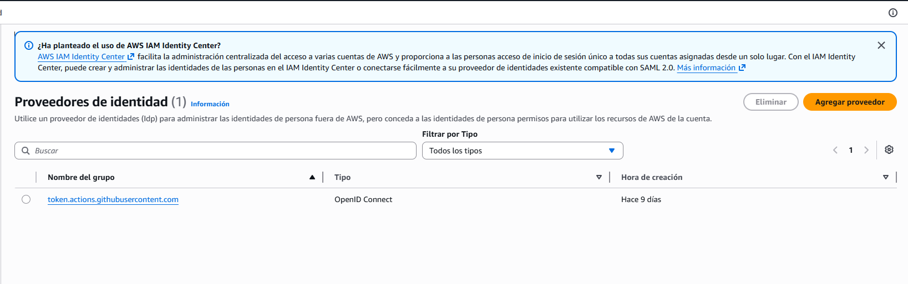

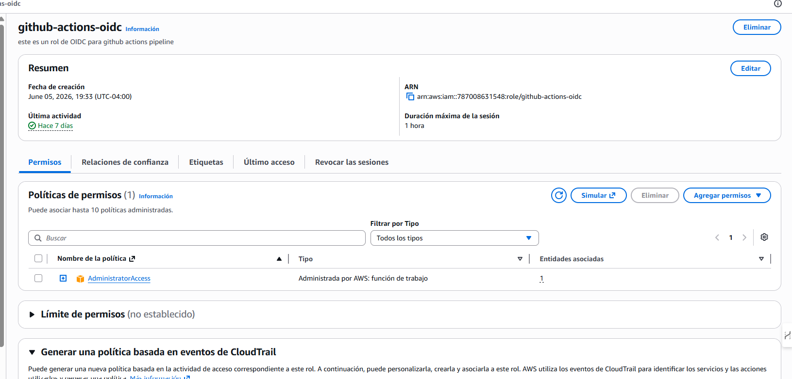

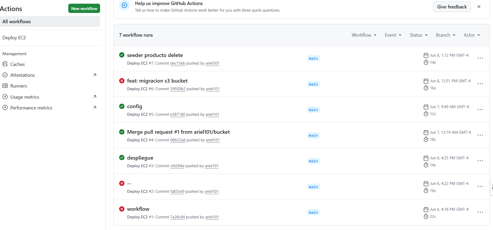

---

## Paso 10 — Almacenamiento S3 para Imágenes de Productos

Se utiliza **Amazon S3** para almacenar las imágenes de los productos textiles (telas, prendas, colecciones) de forma desacoplada de las instancias EC2. Esto permite que cualquier instancia del Auto Scaling Group acceda a los mismos archivos.

### 10.1 Crear Bucket S3

```
S3 → Create bucket
```

| Campo | Valor |
|-------|-------|
| Bucket name | `fabrica-textil-imagenes` |
| Region | `us-east-1` |
| Block all public access | ✓ desactivado |
| Versioning | Desactivado (opcional activar) |

> El bucket es **publica**. Las imágenes se pueden visualizar directamente por que no estan restringidos por que simplemente es para guardar imagenes de productos que no son sensibles

### 10.2 IAM Role para EC2 → S3 (Instance Profile)

Las instancias EC2 usan un **Instance Profile** (IAM Role adjunto a EC2) en lugar de credenciales hardcodeadas. El SDK de AWS lo detecta automáticamente.

```
IAM → Roles → Create role
  Trusted entity: AWS service → EC2
  Name: ec2-laravel-s3-role
```

**Política adjunta:**

```json
{
    "Version": "2012-10-17",
    "Statement": [
        {
            "Sid": "S3Access",
            "Effect": "Allow",
            "Action": [
                "s3:PutObject",
                "s3:GetObject",
                "s3:DeleteObject",
                "s3:ListBucket"
            ],
            "Resource": [
                "arn:aws:s3:::fabrica-textil-imagenes",
                "arn:aws:s3:::fabrica-textil-imagenes/*"
            ]
        }
    ]
}
```

```
EC2 → Instancias → [instancia Laravel]
→ Actions → Security → Modify IAM role → ec2-laravel-s3-role
```

Repetir para todas las instancias del ASG (o incluirlo en el Launch Template).

### 10.3 Configurar Laravel para usar S3

```bash
composer require league/flysystem-aws-s3-v3 --with-all-dependencies
```

`config/filesystems.php`:

```php
's3' => [
    'driver'   => 's3',
    'region'   => env('AWS_DEFAULT_REGION', 'us-east-1'),
    'bucket'   => env('AWS_BUCKET'),
    'visibility' => 'private',
    // Sin 'key' ni 'secret': Laravel usa el Instance Profile automáticamente
],
```

`.env`:

```env
FILESYSTEM_DISK=s3
AWS_BUCKET=fabrica-textil-imagenes
AWS_DEFAULT_REGION=us-east-1
```

### 10.4 Subir y recuperar imágenes de productos

```php
// ProductoController.php
use Illuminate\Support\Facades\Storage;

public function store(Request $request)
{
    $request->validate([
        'nombre'  => 'required|string|max:255',
        'imagen'  => 'required|image|mimes:jpeg,png,webp|max:4096',
    ]);

    // Subir imagen al bucket S3 bajo el prefijo 'productos/'
    $path = $request->file('imagen')->store('productos', 's3');

    Producto::create([
        'nombre'     => $request->nombre,
        'imagen_s3'  => $path,   // ej: productos/abc123.jpg
    ]);

    return redirect()->route('productos.index');
}

public function show(Producto $producto)
{
    // Generar URL firmada (válida 60 minutos) — no expone el bucket
    $urlImagen = Storage::disk('s3')->temporaryUrl(
        $producto->imagen_s3,
        now()->addMinutes(60)
    );

    return Inertia::render('Productos/Show', [
        'producto'  => $producto,
        'urlImagen' => $urlImagen,
    ]);
}

public function destroy(Producto $producto)
{
    // Eliminar imagen del bucket al borrar el producto
    Storage::disk('s3')->delete($producto->imagen_s3);
    $producto->delete();

    return redirect()->route('productos.index');
}
```

### Estructura de prefijos en el bucket

```
fabrica-textil-imagenes/
├── images/          ← imágenes de productos textiles
    ├── abc123.jpg
    └── def456.webp

```

---

> 📸 Evidencias:

<!-- Agregar imagen: ./capturas/s3-bucket.png -->

<!-- Agregar imagen: ./capturas/s3-objects.png -->

---

## Paso 11 — Dominio y HTTPS

> 🔴 **Pendiente — último componente restante**

### Plan de implementación

**Paso 1 — Solicitar certificado SSL en ACM**

```
AWS Certificate Manager → Request certificate
  → Request a public certificate
  Domain name: tu-dominio.com
  Validation method: DNS validation
```

ACM genera un registro CNAME para validar la propiedad del dominio.

**Paso 2 — Configurar DNS**

Opción A (Route 53):
```
Route 53 → Hosted Zones → tu-dominio.com
  → Create record → Alias → Application Load Balancer
    → alb-fabrica-textil (us-east-1)
```

Opción B (registrar externo):
```
Panel DNS del registrar:
  Tipo: CNAME
  Nombre: www
  Valor: alb-fabrica-textil-xxxx.us-east-1.elb.amazonaws.com
```

**Paso 3 — Agregar listener HTTPS al ALB**

```
EC2 → Load Balancers → alb-fabrica-textil
→ Listeners → Add listener

  Protocol: HTTPS
  Port:     443
  Action:   Forward → tg-laravel-app
  Certificate: ACM → tu-dominio.com
```

**Paso 4 — Redirigir HTTP → HTTPS**

```
Listener HTTP:80 → Edit → Default action:
  Redirect to URL
    Protocol: HTTPS
    Port:     443
    Status:   301 (Moved Permanently)
```

**Paso 5 — Actualizar APP_URL en Laravel**

```bash
# En cada instancia (o via SSM)
php artisan config:clear
# Actualizar .env: APP_URL=https://tu-dominio.com
php artisan config:cache
```

---

## Estado del Proyecto

| Componente | Estado |
|------------|--------|
| VPC + Subredes + Internet Gateway | 🟢 Operativo |
| Tablas de rutas | 🟢 Operativo |
| Security Groups | 🟢 Operativo |
| Bastion Host SSH | 🟢 Operativo |
| MySQL Master (subred privada us-east-1a) | 🟢 Operativo |
| MySQL Replica (subred privada us-east-1b) | 🟢 Operativo |
| Replicación Master-Replica | 🟢 Operativo |
| Laravel EC2 (Nginx + PHP-FPM) | 🟢 Operativo |
| Migraciones Laravel | 🟢 Operativo |
| AMI Laravel | 🟢 Operativo |
| Target Group | 🟢 Operativo |
| Application Load Balancer | 🟢 Operativo |
| Auto Scaling Group | 🟢 Operativo |
| OIDC GitHub Actions → IAM Role | 🟢 Operativo |
| Amazon S3 (imágenes de productos) | 🟢 Operativo |
| Dominio + HTTPS (ACM + Route 53) | 🔴 Pendiente |

---

## Bitácora de Avance

### Entrada 1 — 25/05/2026

**Actividades:** Creación de VPC personalizada, subredes pública y privadas, asociación de tablas de rutas, configuración de Internet Gateway.

**Dificultad superada:** Comprensión de la segmentación de red entre componentes públicos y privados dentro de AWS.

---

### Entrada 2 — 26/05/2026

**Actividades:** Despliegue de instancia Laravel, configuración de acceso SSH, implementación del patrón Bastion Host, configuración de Security Groups, verificación de conectividad interna mediante IP privada.

**Dificultad superada:** No era posible conectarse a la instancia MySQL privada por problemas de autenticación SSH y propagación de claves. Se resolvió utilizando **SSH Agent Forwarding** (`ssh -A`).

---

### Entrada 3 — 27/05/2026

**Actividades:** Instalación de MySQL Server, creación de AMI de MySQL, despliegue de MySQL Base y Replica en subredes privadas, configuración de usuario dedicado Laravel, habilitación de acceso remoto MySQL, ejecución de migraciones Laravel, configuración Nginx + PHP-FPM, publicación exitosa de la aplicación.

**Dificultad superada:** Las instancias privadas no tenían salida a internet (sin NAT Gateway). Solución: instancia temporal pública → instalar y configurar MySQL → generar AMI → lanzar instancias finales en subredes privadas a partir de esa AMI.

---

### Entrada 4 — 29/05/2026

**Actividades:** Creación de AMI de Laravel, configuración de Target Group con health checks, despliegue del Application Load Balancer en dos zonas de disponibilidad, creación del Auto Scaling Group con Launch Template y política de Target Tracking (CPU 70%).

---

### Entrada 5 — 06/06/2026

**Actividades:** Configuración de OIDC entre GitHub Actions y AWS IAM. Creación del Identity Provider OIDC en IAM apuntando a `token.actions.githubusercontent.com`, definición del IAM Role con trust policy restringida al repositorio `ariel101/fabrica_textil`, implementación del workflow de despliegue sin credenciales estáticas usando el ARN del Role.

---

### Entrada 6 — 12/06/2026

**Actividades:** Creación del bucket S3 `fabrica-textil-imagenes` con acceso publico, configuración del IAM Instance Profile para acceso EC2 → S3 sin credenciales en código, integración con Laravel Filesystem (driver S3), implementación de subida de imágenes de productos textiles y generación de presigned URLs para acceso seguro.

---

## Resumen de Arquitectura de Red

```
VPC: 10.0.0.0/16  (us-east-1)
│
├── Subred Pública   10.0.0.0/20    us-east-1a  ──► IGW ──► Internet
│     ├── ALB (alb-fabrica-textil)
│     ├── EC2 Laravel #1 (Bastion + App)
│     └── EC2 Laravel #2 (ASG)
│
├── Subred Privada A 10.0.128.0/20  us-east-1a  (sin salida internet)
│     └── EC2 MySQL Master
│
└── Subred Privada B 10.0.144.0/20  us-east-1b  (sin salida internet)
      └── EC2 MySQL Replica
```

---

*Proyecto Final — Cloud Computing — 2026*
